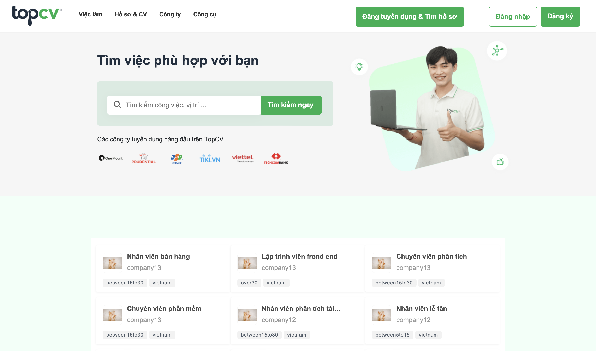

# TopCV Clone API

## [My Live Website](https://topcv-clone.netlify.app)

# Welcome! 👋

To run project run `npm install` then `npm run start:dev`
Require .env file with following format:

PORT=

SERVER_URL=

CLIENT_URL=

DATABASE_HOST=

DATABASE_PORT=

DATABASE_USERNAME=

DATABASE_PASSWORD=

DATABASE_NAME=

JWT_SECRET_KEY=

JWT_EXPIRATION_TIME=

AWS_ACCESS_KEY_ID=

AWS_SECRET_ACCESS_KEY=

AWS_UPLOAD_URL=

SMTP_MAIL=

SMTP_PASS=

## Overview ✨

### The Recruit Website

Your users can be able to:

- Signup Signin with web account or Google account (Forgot password with mail sending)
- Change information for user ( username, password, `upload avatar`, ... )
- Candidate can upload CV to employer (AWS S3 storage)
- Candidate can follow company to get the newest jobs (notification) 
- Management jobs and cv for users with `company` role
- Admin page to manage for users with `admin` role
- **Bonus**: Live chat realtime between company and candidate (Socket)

*Alert:* No responsive (Best perform 1920x1080), Language supported only Vietnamese.

## Technologies

- Client: React [Client source](https://github.com/LPter/topcv-ui)
- Server: NestJS, Typescript, MySQL, Socket, AWS S3
- Details in package.json file

## Got feedback ?

It's just my simple and messy project I build in my free time to practice what i have learned.
So i would very appreciate if you have any feedback.
Please contact email nguyenvanminhvu@gmail.com

**Feel free to fork !**  🚀
